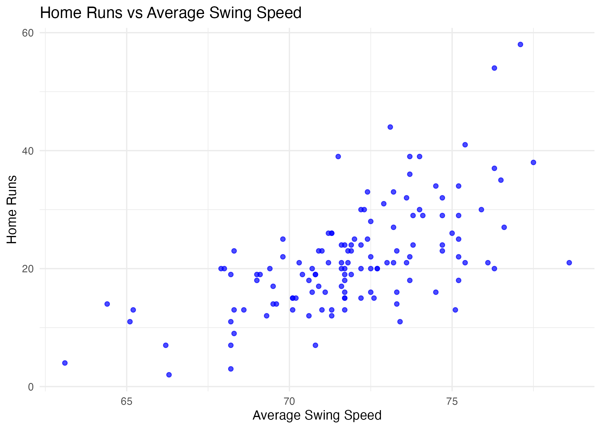

# Analyzing the Correlation between Swing Speed and Related Metrics in Major League Baseball

This repo analyzes how average swing speed impacts offensive performance for Major League Baseball players. It explores which factors such as home runs, whiff %, strikeout %, and launch angle—are most affected by swing speed. In addition, it examines whether a player’s league or position has a relationship to swing speed.

## Overview

This project explores average swing speed relationship to offensive performance. Using statistics from Baseball Savant and Baseball Reference, we can see which metrics are most affected by swing speed (home runs, whiff rate, strikeout rate, and launch angle). In addition we are investigating whether a player's position or league has any relationship with swing speed. This would show us if swing speed is influenced from their roles or organization and seeing if that relationship is significant. 

Our overall goal of this project is to see how effective swing speed could be used to evaluate players and just finding out if there is a correlation or relationship. This analysis could be used by scouts, sports journalists or fans. 

## Interesting Insight

One key insight from our analysis is that players with higher average swing speed tend to hit more home runs.  
This agrees with the idea that swing speed is good predictor for home runs.

## Repo Structure

This repository contains code, data, and documentation used in the analysis.

### Key Files

| FinalProjectCode.qmd        | Main analysis file with data cleaning, wrangling, anaylsis, and visualizations. |

| FinalProjectReport.qmd      | Final polished write-up report. |

| FinalProjectCode.html       | coding rendered as a HTML. |

| README.md                   | Project summary and structure (this file) |

| FinalProjectInitialPlan.txt | Planning document  & outlining |

| Project_Guidelines.md       | Prof Hatfield rules and expectations of the project. |

| NOTES                       | notes used durring project. |

## Data Sources and Acknowledgements

- **Baseball Savant** ([baseballsavant.mlb.com](https://baseballsavant.mlb.com/)) — gave swing speed and metrics (whiff %, hard hit %, etc.).
- **Baseball Reference** ([baseball-reference.com](https://www.baseball-reference.com/leagues/majors/2024-standard-batting.shtml)) — gave position and league

## Authors

- Atticus Renault: akr6351@psu.edu

- Noah Tobias  nwt5144@psu.edu

- Sean Dasovich: sgd5239@psu.edu